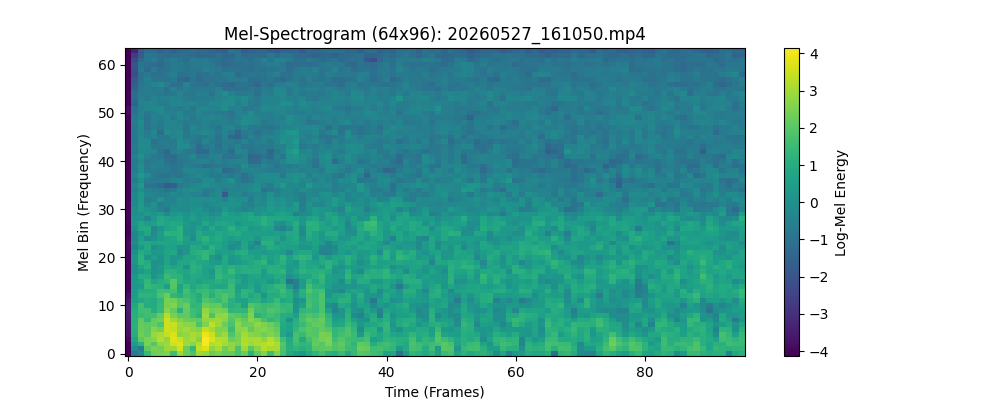

# edge-av-fusion

**Multimodal Edge-AI Perception Pipeline — acoustic early-warning + vision confirmation for robot blind spots, on NVIDIA Jetson Xavier AGX.**

> Audio is the cheap, always-on tripwire. Vision is the expensive judge, woken only when sound says "look now." The system localizes and classifies approaching vehicles from a 2-mic array at < 1 W incremental cost, and escalates to the camera only on a fused acoustic trigger.


---

## Table of Contents
- [Why this exists](#why-this-exists)
- [System overview](#system-overview)
- [Results](#results)
- [Key engineering decisions](#key-engineering-decisions)
- [Stationary-source suppression](#stationary-source-suppression)
- [Module map](#module-map)
- [Hardware status](#hardware-status)
- [Getting started](#getting-started)
- [Roadmap](#roadmap)
- [Tech stack](#tech-stack)

---

## Why this exists

A mobile robot has blind spots a camera alone cannot watch cheaply: a forward-facing
detector must run continuously and burns power to catch something that approaches from
behind. Sound arrives first and omnidirectionally. This project uses a **2-stage,
2-power-domain** design:

| Path | Hardware | Duty | Power |
|---|---|---|---|
| **Always-on tripwire** | 2-mic array → CPU DoA → GPU/DLA classifier | continuous | < 1 W incremental |
| **On-demand judge** | camera → detector | gated by acoustic trigger | high, but rare |

The hard engineering is in the cheap path: estimate *where* a sound is (GCC-PHAT
direction-of-arrival), decide *what* it is (TensorRT vehicle-sound classifier), and
*fuse* the two through a state machine that only wakes the camera when both agree.

---

## System overview

```
                 ┌────────────────────── LOW-POWER ALWAYS-ON PATH ──────────────────────┐
                 │                                                                       │
 Mode A: 2-Mic HAT (I2S, 48 kHz stereo)                                                 │
 Mode B: .mp4 ──qtdemux──► audio branch (clock-paced, faithful live sim)                │
                 │                                                                       │
                 ▼                                                                       │
        ┌────────────────┐   48 kHz stereo   ┌─────────────────┐   τ (sub-sample)  ┌────────┐
        │ GStreamer      │ ────────────────► │ GCC-PHAT (CPU,  │ ────────────────► │ DoA    │
        │ appsink →      │                   │ numpy rFFT) +   │                   │ Track- │
        │ ring buffer    │                   │ adaptive gate   │                   │ er     │
        └────────────────┘                   └─────────────────┘                   └───┬────┘
                 │ 16 kHz mono (decimated)                                             │
                 ▼                                                                     ▼
        ┌────────────────┐  log-mel 64×96  ┌──────────────────────┐  vehicle p>θ  ┌──────────┐
        │ GPU Mel-Spec   │ ──────────────► │ TensorRT FP16 / DLA  │ ────────────► │ Fusion   │
        │ (torchaudio)   │                 │ vehicle classifier   │               │ FSM      │
        └────────────────┘                 └──────────────────────┘               └────┬─────┘
                                                                                       │ trigger
                 ┌─────────────────── HIGH-POWER ON-DEMAND PATH ──────────────────────┤
                 ▼                                                                     ▼
        ┌────────────────┐   confirm/locate   ┌──────────────┐  ROS 2 /av_fusion/detections
        │ Camera+detector│ ─────────────────► │ AvDetection  │ ──────────► ESP32 / downstream
        │ (NVMM, gated)  │                    │ publisher    │
        └────────────────┘                    └──────────────┘
```

Two run modes share **one code path** (so benchmarks measure production, not a stub):
- **Mode A** — live ReSpeaker 2-Mic HAT capture over I2S.
- **Mode B** — `.mp4` replayed at `sync=true` realtime pacing through GStreamer; this is
  how the pipeline is validated against real phone-recorded street/vehicle clips today,
  before the mic array hardware is mounted.

Full design rationale: **[docs/ARCHITECTURE.md](docs/ARCHITECTURE.md)** ·
Task breakdown & acceptance criteria: **[docs/TASKS.md](docs/TASKS.md)**

---

## Results

### End-to-end latency (Jetson Xavier AGX, MAXN, 3993 hops, synthetic source)

| stage | p50 | p95 | budget |
|---|---|---|---|
| GCC-PHAT (numpy, 4096 win) | 1.51 ms | 1.73 ms | 1 ms target, dominated by FFT |
| Mel-spectrogram (GPU) | 1.34 ms | 1.43 ms | 5 ms |
| TensorRT classifier (FP16) | 3.27 ms | 3.34 ms | 5 ms |
| Fusion FSM | 0.02 ms | 0.03 ms | 1 ms |
| **end-to-end hop** | **2.43 ms** | **2.90 ms** | **< 50 ms p95** |

E2E p95 is ~17× under budget; the real latency floor is the acoustic windowing, not compute.

### "What NOT to put on the GPU" — GCC-PHAT backend duel (mean ms/call, 200 reps)

| window | numpy (CPU) | torch-cuda (GPU) |
|---|---|---|
| 1024 | **0.98** | 2.65 |
| 4096 *(production)* | **1.42** | 1.91 |
| 16384 | 4.57 | **2.50** |

At the production window size (4096) the **CPU wins** — a 10⁶-FLOP FFT is too small to
amortize CUDA launch overhead. Knowing what *not* to accelerate is the point of this
table. (TensorRT is reserved for the classifier, where it earns its place.)

### Acoustic discrimination (real phone clips, classifier-only mode)

| clip | before suppression | after suppression |
|---|---|---|
| car passing slowly (3 cars) | 650 alert hops | **650** (unchanged ✓) |
| museum / stationary machinery | 625 alert hops | **0** (false alarm eliminated ✓) |
| outdoor background | 0 | **0** ✓ |

See [Stationary-source suppression](#stationary-source-suppression) for how.

### What the classifier sees



A single 0.96 s log-mel patch (64 mels × 96 frames) of a car passing. Energy is
concentrated in the **low mel bins (0–30)** — the engine rumble — while the high
bins stay quiet. That low-frequency fingerprint is what the CNN keys on; it is also
why a museum HVAC unit fools a single snapshot, and why temporal suppression is
needed (see below).

### GPU stays idle — measured, not assumed

Running the full pipeline on-device with the classifier on the GPU:

| metric | value | implication |
|---|---|---|
| GPU compute (GR3D) | **1.5 % avg, 5 % peak** | the 1 Hz classifier barely registers |
| GPU power | **~1.1 W avg** (idle) | audio path is effectively free |

This is the honest punchline on **DLA offload**: the DLA engine is built
(`vehicle_dla.plan`), but the classifier is so light that moving it off the GPU
saves nothing on the audio path. DLA's real value is **reserving the GPU's tensor
cores for the future vision detector** — not optimizing a workload that already uses
1.5 % of them. Knowing what *not* to offload is the same senior skill as the
GCC-PHAT CPU decision above.

---

## Key engineering decisions

The architecture doc challenges a naïve baseline (PyAudio + 16 kHz GCC-PHAT + "put it all
on the GPU"). Highlights:

1. **Capture at 48 kHz, not 16 kHz.** At 2-mic spacing (5.8 cm) the max time-difference is
   ~169 µs. At 16 kHz that's ±2.7 samples — ~6 distinguishable angles, useless. At 48 kHz
   it's ±8.1 samples, and with parabolic sub-sample interpolation angular RMSE drops from
   ~15–20° to ~5–8°. Decimate to 16 kHz *only* for the classifier branch.

2. **GCC-PHAT stays on the CPU.** Measured, not assumed — see the duel table above.

3. **TensorRT only where it pays.** Signal processing (FFT) has no weights to quantize and
   no fusible graph; the CNN classifier is exactly TRT's target. FP16 on Xavier's Volta
   tensor cores ≈ 2× over FP32 at negligible accuracy loss.

4. **GStreamer for transport, single process + threads for compute.** One abstraction for
   both live mic and file replay; the DSP/inference threads live in numpy/torch/TRT C
   extensions that release the GIL, so threads give real concurrency without
   multiprocessing's serialization tax. ("Lock-free SPSC ring buffer in pure Python" is a
   myth on weakly-ordered ARM — we use a *locked* ring and call it what it is.)

5. **Graceful degradation.** If the TRT engine fails to load (version bump), the classifier
   falls back to an energy-trigger mode rather than killing the node. The acoustic tripwire
   must never be the thing that silently dies.

---

## Stationary-source suppression

The classifier can't tell a car engine from a museum HVAC unit in a single 0.96 s snapshot
— they're acoustically similar. But their *temporal signature* differs:

```
Car (transient):   0.1 → 0.7 → 0.9 → 0.8 → 0.2 → 0.1     confidence std ≈ 0.30  → ALERT
Machine (steady):  0.8 → 0.8 → 0.8 → 0.8 → 0.8 → 0.8     confidence std ≈ 0.02  → SUPPRESS
```

The fusion FSM (`src/avfusion/fusion/fsm.py`) adds two physics-motivated filters that need
**no retraining**:

- **Variance filter** — over a rolling window of classifier scores (`cls_history`), a
  vehicle-probability with std below `min_cls_std` is a constant source → suppress.
- **Sustained-alert filter** — an alert held continuously beyond `max_sustained_alert_s`
  cannot be a passing car → suppress.
- **Suppression gate** — once suppressed, re-triggering is blocked until confidence drops
  below θ/2 (proving the source actually stopped), preventing rapid on/off oscillation.

This is the cheap, interpretable version of what an LSTM/Transformer sequence model would
learn; the roadmap below covers the learned upgrade. With a real mic array, a *third*
signal becomes available for free: a moving car's DoA angle sweeps over time, a stationary
machine's does not.

All thresholds are config (`config/pipeline.yaml`):

```yaml
fusion:
  classifier_only: false      # true for phone video (no reliable DoA)
  max_sustained_alert_s: 15.0 # suppress alerts longer than a plausible pass-by
  cls_history: 5              # classifier calls in the variance window
  min_cls_std: 0.08           # below this std → stationary source → suppress
```

---

## ROS 2 graph

The whole pipeline runs inside one rclpy node (`/av_fusion`); the ESP32 bridge is a
separate node so the alert sink can be swapped without touching the pipeline.

```
        nav_msgs/Odometry              std_msgs/Bool
        /odom ───────────┐       ┌──── /av_fusion/vision_confirmation
        (yaw for           ▼       ▼      (camera node confirms a TRIGGERED event)
         ambiguity)   ┌─────────────────────┐
  mic / .mp4 ────────►│   /av_fusion  node   │  owns DSP + inference threads
   (GStreamer)        └──────────┬──────────┘
                                 │ publishes
        ┌────────────────────────┼─────────────────────────────┐
        ▼                        ▼                              ▼
 /av_fusion/detections   /av_fusion/diagnostics   /av_fusion/vision_confirmation_request
 (AvDetection,           (DiagnosticArray, 1 Hz)  (std_msgs/Bool, edge-triggered "look now")
  SensorDataQoS)                                              │
        │                                                     ▼
        ▼                                          gated camera node (v1.1)
 ┌──────────────────┐
 │  /esp32_bridge   │ ──UART──► ESP32  (buzzer / LED alert)
 └──────────────────┘
```

> Rendered headlessly from the node's topic interface (the Xavier runs over SSH with no
> X display, so `rqt_graph` is unavailable on the box). Topic names come from the `ros:`
> section of `config/pipeline.yaml`.

---

## Module map

```
src/avfusion/
  config.py                  typed dataclass config + YAML loader (fails on typos)
  audio/ring_buffer.py       SPSC ring buffer (locked, honest), numpy-backed
  audio/gst_file_source.py   Mode B — qtdemux, clock-paced audio (+ optional video)
  audio/gst_alsa_source.py   Mode A — GStreamer alsasrc (live mic)
  dsp/gcc_phat.py            GCC-PHAT: numpy + torch backends, sub-sample interp,
                             adaptive noise-floor gate (median/MAD on peak prominence)
  dsp/mel.py                 GPU log-mel (torchaudio), 64 mels × 96 frames
  inference/model.py         VehicleSoundNet — MobileNetV2-style CNN, ~0.6 M params
  inference/trt_engine.py    TRT 8.5 runtime wrapper (engine load, pinned I/O)
  inference/classifier.py    mel patch → class probs, energy-trigger fallback
  fusion/tracker.py          DoA α-β tracker, front/back hypothesis, yaw fusion
  fusion/fsm.py              IDLE→CANDIDATE→TRIGGERED→CONFIRMED + stationary suppression
  bench/                     latency · gcc duel · power sweep · membw · doa validation
tools/
  train_classifier.py        DDP-ready training, AMP, W&B, custom-audio augmentation
  export_onnx.py             torch → ONNX (opset 13, static [1,1,64,96])
  build_trt_engine.py        trtexec wrapper → .plan + build report
  analyze_clip.py            run a real clip through the full pipeline, summarize
  calibrate_mic.py           estimate effective mic spacing from a clap recording
  visualize_mel.py           render a mel-spectrogram PNG from a clip
scripts/
  esp32_bridge.py            ROS 2 → ESP32 serial bridge (alert state over UART)
ros2_ws/src/
  av_fusion_interfaces/      AvDetection.msg
  av_fusion_node/            rclpy node: owns pipeline, pubs detections, subs vision+odom
```

---

## Hardware status

| Component | State |
|---|---|
| Jetson Xavier AGX 32 GB | ✅ pipeline runs on-device (JetPack 5.1, CUDA 11.4, TRT 8.5.2, ROS 2 Foxy) |
| TensorRT FP16 engine | ✅ built & validated (FP16 vs FP32 cosine > 0.999) |
| TensorRT DLA engine | ✅ built (`vehicle_dla.plan`); measured GPU-idle proves DLA isn't needed for the audio path — reserved for the future vision detector |
| ESP32 serial bridge | ✅ code complete · ⏳ hardware not yet wired |
| **ReSpeaker 2-Mic HAT** | ⏳ **not yet acquired** — DoA validated in software via phone clips |

> **On DoA today:** the GCC-PHAT direction-of-arrival stack is fully implemented and unit-
> tested against synthetic fractional-delay signals. Real angular validation needs the
> physical mic array; until then the pipeline runs in `classifier_only` mode on phone
> video, where smartphone stereo audio processing removes the raw inter-channel delay that
> DoA depends on (confirmed with `tools/calibrate_mic.py`). The classifier + temporal
> suppression carry detection in the meantime; DoA comes online with the hardware.

---

## Getting started

```bash
# environment (Jetson, JetPack 5): venv with system site packages for tensorrt/gi/ROS
python3.8 -m venv .venv --system-site-packages
source .venv/bin/activate
pip install -r requirements.txt        # NVIDIA torch wheel + torchaudio for JP5

# run a real clip through the full pipeline (Mode B)
python tools/analyze_clip.py path/to/clip.mp4 --classifier-only

# rebuild the TensorRT engine on-device (engines are not portable across GPUs/TRT versions)
python tools/build_trt_engine.py            # GPU FP16
/usr/src/tensorrt/bin/trtexec --onnx=models/vehicle.onnx --fp16 \
    --useDLACore=0 --allowGPUFallback --saveEngine=models/vehicle_dla.plan   # DLA

# launch the ROS 2 node (Mode B)
ros2 launch av_fusion_node pipeline.launch.py mode:=file media:=clip.mp4

# benchmarks
PYTHONPATH=src python -m avfusion.bench.latency --gcc-backend numpy
PYTHONPATH=src python -m avfusion.bench.power_sweep        # needs sudo (nvpmodel)
```

### Generating demo assets

Rendered visuals live in `docs/assets/` (raw media is `.gitignore`d). To regenerate:

```bash
python tools/visualize_mel.py Edge-materials/<car_passby>.mp4   # mel-spectrogram PNG  ✓ committed
sudo tegrastats --interval 200 > docs/assets/power_trace_gpu.txt &   # power trace      ✓ committed
PYTHONPATH=src python -m avfusion.bench.doa_validation          # synthetic DoA polar data (TODO)
ros2 launch av_fusion_node pipeline.launch.py mode:=file media:=clip.mp4 &  # then: rqt_graph (TODO)
```

---

## Roadmap

### Near-term (no new hardware needed)
- [ ] **Fine-tune to F1(vehicle) ≥ 0.85.** Current model trained on ESC-50 + a handful of
      self-recorded clips; expand with the AudioSet vehicle subset. Runs on a desktop GPU
      (or Kaggle 2×T4 via the DDP path already in `train_classifier.py`).
- [ ] **Temporal sequence model.** Replace the hand-tuned variance/sustained filters with a
      learned LSTM/Transformer over a sequence of mel patches — capture approach→pass→recede
      dynamics directly instead of via FSM heuristics.
- [ ] **24 h soak test** (Mode A, once mic is mounted): RSS-slope ≈ 0, xrun recovery.

### Hardware-gated
- [ ] **ReSpeaker 2-Mic HAT bring-up.** seeed-voicecard DKMS + I2S device-tree overlay for
      L4T R35 kernel 5.10; finger-tap L/R channel verification.
- [ ] **Field DoA validation.** Speaker at {0, ±30, ±60, ±90}°, 1 m & 3 m, chirp + pink
      noise + recorded engine → per-angle bias/RMSE table, endfire confusion.
- [ ] **Vision confirmer node.** Gated camera + detector consuming TRIGGERED events;
      NVMM-resident frames (the only place unified-memory optimization actually matters).
- [ ] **ESP32 alert hardware.** Wire the existing serial bridge to a physical
      buzzer/LED/haptic indicator.

### v2 (architecture-level)
- [ ] **4-mic square array** → full 360° azimuth via SRP-PHAT (same code structure,
      collapses the front/back ambiguity a 2-mic linear array can't resolve).
- [ ] **Wearable / smart-glasses data path.** Generalize the phone-video ingest into a
      portable capture format for egocentric audio-visual data collection.

---

## Tech stack

`Python 3.8` · `PyTorch` · `TensorRT 8.5 (FP16 + DLA)` · `ONNX` · `torchaudio` ·
`GStreamer` · `ROS 2 Foxy` · `NumPy` · `Weights & Biases` · `NVIDIA Jetson Xavier AGX`

---

*Acoustic early-warning + vision confirmation for autonomous-robot blind spots.
Built and validated on-device.*
